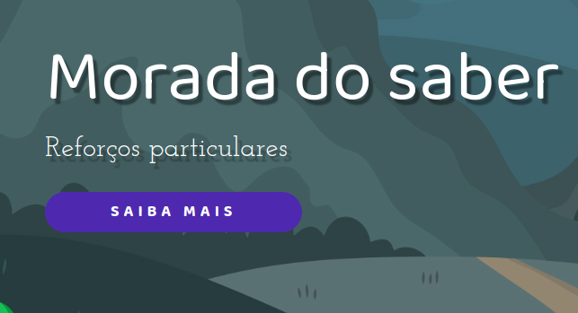
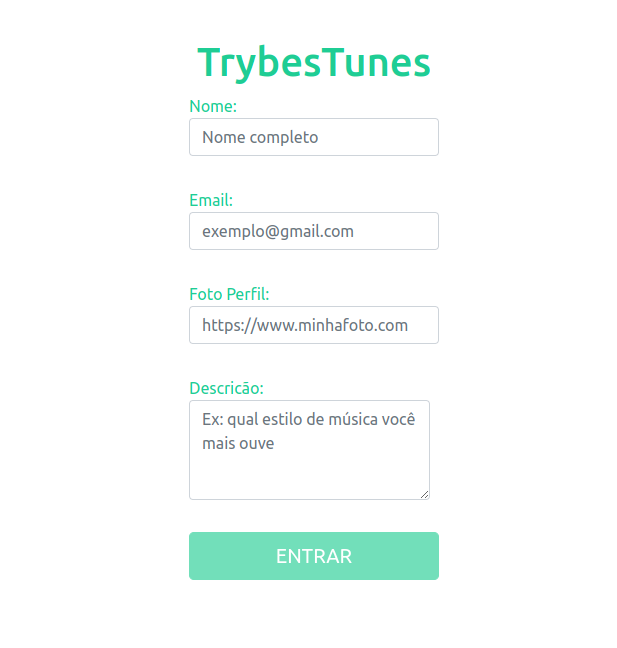

## Oi, eu sou Igor Alex de Castro!!! 👋
- 🕹️ Atualmente estou cursando engenharia da computação na UNISAL.
- ❤️ Estudando e aprofundando no desenvolvimento Front-end.

  <a href="https://github.com/Igor-Alex-Castro">
  
  

##

 
  
  
  
  

 
  
  

##

 
  
   
   
  
   
  
 

  <h3 align="left">Projetos</h3>
<table>
  
  <tr>
        <td valign="top">
        <h3 align="left">Morada do Saber</h3>
        
<a href="https://igor-alex-castro.github.io/morada-do-saber/">GitHub Page</a>, <a href="https://github.com/Igor-Alex-Castro/morada-do-saber">Reposirotio</a>

        
<a href="">Vídeo do projeto</a>

        
HTML, CSS e JS

        
        
          
      </td>  
     <td valign="top">
        <h3 align="left">Trybe Tunes</h3>
        
<a href="https://igor-alex-castro.github.io/projeto-trybetunes/">GitHub Page</a>, <a href="https://github.com/Igor-Alex-Castro/projeto-trybetunes">Reposirotio</a>

        
<a href="https://www.youtube.com/watch?v=0IP06bzmUB8">Vídeo do projeto</a>

        
React, Jest e RTL

        
        
      </td>  
    <td valign="top">
      <h3 align="left">Trybe Wallet</h3>
        
<a href="https://igor-alex-castro.github.io/projeto-trybe-wallet/">GitHub Page</a>, <a href="https://github.com/Igor-Alex-Castro/projeto-trybe-wallet">Reposirotio</a>

        
<a href="">Vídeo do projeto</a>

      
React com Redux, thunk, 
          Jest e RTL

        
      </td>  
  </tr>  
</table>
 
